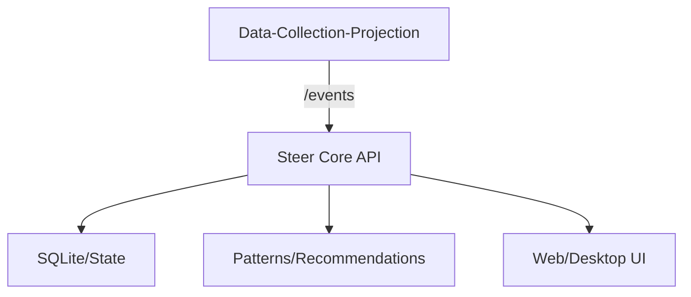

# Local OS Agent (Rust Native) + Data Collection (DCP)

이 프로젝트는 **Data-Collection-Projection(DCP)** 수집기와 **Steer Core(Rust)**를 연동해
로컬 OS 이벤트를 수집/분석하고 자동화를 제안·실행하는 시스템입니다.

## Architecture


## 구성 요소
- **Collector**: `collector/Data-Collection-Projection` (Python, /events 수집)
- **Core**: `apps/core` (Rust, 정책/분석/API)
- **UI**: `apps/web`, `apps/desktop` (선택)
- **Scripts**: `scripts` (빌드/가디언/서비스 유틸)

## 사전 준비 (Windows 기준)
- **Conda** (DATA_C 환경 사용)
- **Python 3.11** (DCP)
- **Rust toolchain** (Core)
- **Node.js + npm** (n8n/웹 빌드 필요 시)

## 설치
### 1) DCP (데이터 수집기)
```powershell
conda activate DATA_C
cd collector\Data-Collection-Projection
python -m pip install --upgrade pip
pip install -r requirements.txt
python scripts\init_db.py
```

### 2) Core (Rust)
```powershell
cd apps\core
cargo build --release
```

## 실행 방법
### 1) DCP 실행
```powershell
conda activate DATA_C
.\scripts\run_dcp.ps1
```
기본 포트: `http://127.0.0.1:8080/events`

### 2) Core 실행 (DCP 연동)
```powershell
$env:STEER_COLLECTOR_MODE="dcp"
$env:STEER_DCP_ENDPOINT="http://127.0.0.1:8080/events"

cd apps\core
cargo run --release --bin local_os_agent
```

## 환경변수
- **STEER_COLLECTOR_MODE**: `dcp` 또는 `internal`
- **STEER_DCP_ENDPOINT**: DCP 이벤트 수집 주소 (기본 `http://127.0.0.1:8080/events`)
- **OPENAI_API_KEY**: LLM 기능 사용 시
- **N8N_API_URL / N8N_API_KEY**: n8n 연동 시

## 테스트 (선택)
### DCP 이벤트 전송
```powershell
$body = @{
  schema_version="1.0"
  source="os"
  app="OS"
  event_type="os.app_focus_block"
  resource=@{type="window"; id="test_window"}
  payload=@{duration_sec=3; window_title="test_title"}
} | ConvertTo-Json -Depth 5

Invoke-RestMethod -Method Post -Uri "http://127.0.0.1:8080/events" `
  -ContentType "application/json" -Body $body
```

### Core API 확인
```powershell
Invoke-RestMethod http://127.0.0.1:5680/health
```

## UI 빌드 (선택)
```powershell
.\scripts\build_release.ps1
```
결과물: `apps/desktop/src-tauri/target/release/bundle`

## 파일 구조
```
.
├─ apps/
│  ├─ core/
│  │  ├─ Cargo.toml
│  │  ├─ src/
│  │  │  ├─ main.rs             # 엔트리
│  │  │  ├─ api_server.rs       # /events, API
│  │  │  ├─ analyzer.rs         # 패턴 분석
│  │  │  └─ collector_bridge.rs # DCP 연동
│  │  └─ README.md
│  ├─ web/
│  │  ├─ package.json
│  │  └─ src/
│  └─ desktop/
│     ├─ package.json
│     └─ src-tauri/
├─ collector/
│  └─ Data-Collection-Projection/
│     ├─ src/                    # 수집 파이프라인
│     ├─ configs/                # config.yaml 등
│     ├─ scripts/                # init_db/run_core
│     └─ requirements.txt
├─ scripts/
│  ├─ run_dcp.ps1
│  ├─ build_release.ps1
│  └─ steer-guardian.ps1
└─ .gitignore
```

## 트러블슈팅
- **DCP가 안 뜸**: `conda activate DATA_C` 확인, `pip install -r requirements.txt` 재확인
- **Core가 이벤트를 못 받음**: `STEER_DCP_ENDPOINT`가 DCP 주소와 동일한지 확인
- **포트 충돌**: DCP(8080) / Core(5680) 다른 프로세스가 점유 중인지 확인

## Notes
- DCP는 데이터 수집 전용이며, Core는 정책/추천/LLM 처리 담당.
- UI는 선택사항이며 Core API만으로도 동작 가능.
