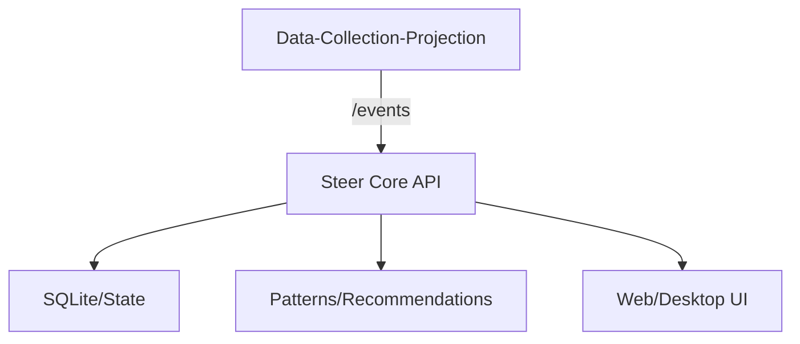

# Local OS Agent (Rust Native)

**사용자 행동 기반 자동화 에이전트** — 로컬 OS 작업을 관찰/분석하고 자동화를 추천·실행합니다.

## Architecture

- **Collector**: `collector/Data-Collection-Projection` (Python, /events 수집)
- **Core**: `apps/core` (Rust, 정책/분석/API)
- **UI**: `apps/web`, `apps/desktop`

## 실행방법 (Windows)

### 1) 데이터 수집기(DCP) 실행
```powershell
conda activate DATA_C
.\scripts\run_dcp.ps1
```

### 2) Core 실행 (DCP 연동)
```powershell
$env:STEER_COLLECTOR_MODE="dcp"
$env:STEER_DCP_ENDPOINT="http://127.0.0.1:8080/events"

cd apps\core
cargo run --release --bin local_os_agent
```

### 3) (선택) UI 빌드
```powershell
.\scripts\build_release.ps1
```

## 파일구조
```
.
├─ apps/
│  ├─ core/
│  │  ├─ Cargo.toml
│  │  ├─ src/
│  │  │  ├─ main.rs             # 엔트리
│  │  │  ├─ api_server.rs       # /events, API
│  │  │  ├─ analyzer.rs         # 패턴 분석
│  │  │  └─ collector_bridge.rs # DCP 연동
│  │  └─ README.md
│  ├─ web/
│  │  ├─ package.json
│  │  └─ src/
│  └─ desktop/
│     ├─ package.json
│     └─ src-tauri/
├─ collector/
│  └─ Data-Collection-Projection/
│     ├─ src/                    # 수집 파이프라인
│     ├─ configs/                # config.yaml 등
│     ├─ scripts/                # init_db/run_core
│     └─ README.md
├─ docs/
│  └─ project/        # 프로젝트 문서
├─ scripts/
│  ├─ run_dcp.ps1
│  ├─ build_release.ps1
│  └─ steer-guardian.ps1
├─ tests/             # 테스트
└─ README.md
```
