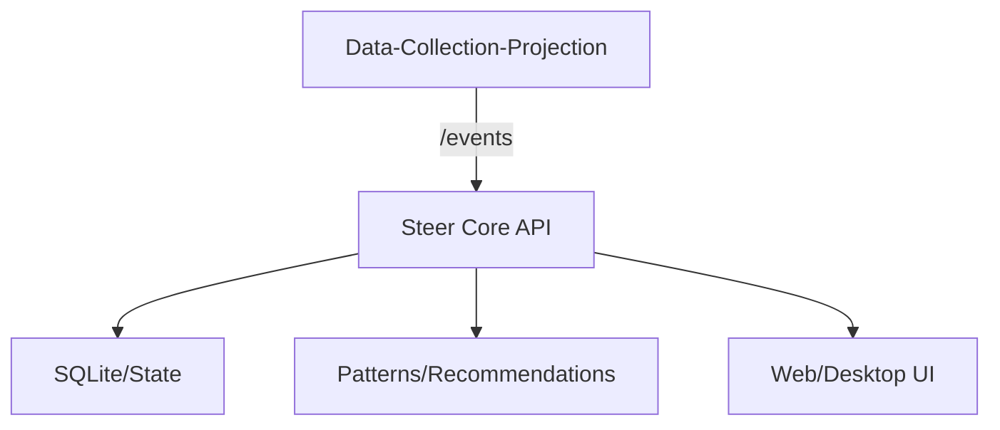
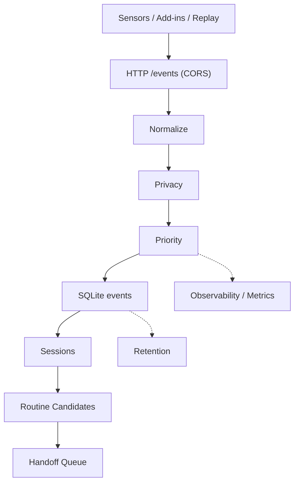

# Local OS Agent (Rust Native) + Data Collection (DCP)

이 프로젝트는 **Data-Collection-Projection(DCP)** 수집기와 **Steer Core(Rust)**를 연동해
로컬 OS 이벤트를 수집/분석하고 자동화를 제안·실행하는 시스템입니다.

## Architecture


## 구성 요소
- **Collector**: `collector/Data-Collection-Projection` (Python, /events 수집)
- **Core**: `apps/core` (Rust, 정책/분석/API)
- **UI**: `apps/web`, `apps/desktop` (선택)
- **Scripts**: `scripts` (빌드/가디언/서비스 유틸)

## 사전 준비 (Windows 기준)
- **Conda** (DATA_C 환경 사용)
- **Python 3.11** (DCP)
- **Rust toolchain** (Core)
- **Node.js + npm** (n8n/웹 빌드 필요 시)

## 설치
### 1) DCP (데이터 수집기)
```powershell
conda activate DATA_C
cd collector\Data-Collection-Projection
python -m pip install --upgrade pip
pip install -r requirements.txt
python scripts\init_db.py
```

### 2) Core (Rust)
```powershell
cd apps\core
cargo build --release
```

## 실행 방법
### 1) DCP 실행
```powershell
conda activate DATA_C
.\scripts\run_dcp.ps1
```
기본 포트: `http://127.0.0.1:8080/events`

### 2) Core 실행 (DCP 연동)
```powershell
$env:STEER_COLLECTOR_MODE="dcp"
$env:STEER_DCP_ENDPOINT="http://127.0.0.1:8080/events"

cd apps\core
cargo run --release --bin local_os_agent
```

## 환경변수
- **STEER_COLLECTOR_MODE**: `dcp` 또는 `internal`
- **STEER_DCP_ENDPOINT**: DCP 이벤트 수집 주소 (기본 `http://127.0.0.1:8080/events`)
- **OPENAI_API_KEY** 또는 **LLM_API_KEY**: LLM 기능 사용 시 (config의 `llm.api_key_env` 값과 동일)
- **LLM_ENDPOINT / LLM_MODEL**: LLM endpoint/model을 config에 반영할 때 참고
- **N8N_API_URL / N8N_API_KEY**: n8n 연동 시

## 테스트 (선택)
### DCP 이벤트 전송
```powershell
$body = @{
  schema_version="1.0"
  source="os"
  app="OS"
  event_type="os.app_focus_block"
  resource=@{type="window"; id="test_window"}
  payload=@{duration_sec=3; window_title="test_title"}
} | ConvertTo-Json -Depth 5

Invoke-RestMethod -Method Post -Uri "http://127.0.0.1:8080/events" `
  -ContentType "application/json" -Body $body
```

### Core API 확인
```powershell
Invoke-RestMethod http://127.0.0.1:5680/health
```

## UI 빌드 (선택)
```powershell
.\scripts\build_release.ps1
```
결과물: `apps/desktop/src-tauri/target/release/bundle`

## 파일 구조
```
.
├─ apps/
│  ├─ core/
│  │  ├─ Cargo.toml
│  │  ├─ src/
│  │  │  ├─ main.rs             # 엔트리
│  │  │  ├─ api_server.rs       # /events, API
│  │  │  ├─ analyzer.rs         # 패턴 분석
│  │  │  └─ collector_bridge.rs # DCP 연동
│  │  └─ README.md
│  ├─ web/
│  │  ├─ package.json
│  │  └─ src/
│  └─ desktop/
│     ├─ package.json
│     └─ src-tauri/
├─ collector/
│  └─ Data-Collection-Projection/
│     ├─ src/                    # 수집 파이프라인
│     ├─ configs/                # config.yaml 등
│     ├─ scripts/                # init_db/run_core
│     └─ requirements.txt
├─ scripts/
│  ├─ run_dcp.ps1
│  ├─ build_release.ps1
│  └─ steer-guardian.ps1
└─ .gitignore
```

## 트러블슈팅
- **DCP가 안 뜸**: `conda activate DATA_C` 확인, `pip install -r requirements.txt` 재확인
- **Core가 이벤트를 못 받음**: `STEER_DCP_ENDPOINT`가 DCP 주소와 동일한지 확인
- **포트 충돌**: DCP(8080) / Core(5680) 다른 프로세스가 점유 중인지 확인

## Notes
- DCP는 데이터 수집 전용이며, Core는 정책/추천/LLM 처리 담당.
- UI는 선택사항이며 Core API만으로도 동작 가능.

---

## DCP (Data-Collection-Projection) 상세
Minimal data collection pipeline that ingests JSON events, normalizes them,
applies privacy/priority rules, and stores rows in SQLite. It also builds
sessions, routine candidates, and handoff packages for downstream agents.

### Architecture


Key runtime signals:
- /health and /stats endpoints
- JSON line logs with 1-minute metrics snapshots
- retention cleanup logs

### Quick start (Windows + Conda)
```powershell
conda create -n DATA_C python=3.11.14 -y
conda activate DATA_C
python -m pip install --upgrade pip
pip install -r requirements.txt
```

Initialize the DB:
```powershell
python scripts\init_db.py
```

Run the core:
```powershell
$env:PYTHONPATH = "src"
python -m collector.main --config configs\config.yaml
```

Run a separate collection (run2 DB/logs):
```powershell
$env:PYTHONPATH = "src"
python -m collector.main --config configs\config_run2.yaml
```

Run a separate collection (run3 DB/logs):
```powershell
$env:PYTHONPATH = "src"
python -m collector.main --config configs\config_run3.yaml
```

Run a separate collection (run4 DB/logs):
```powershell
$env:PYTHONPATH = "src"
python -m collector.main --config configs\config_run4.yaml
```

Run a separate collection (run5 DB/logs):
```powershell
$env:PYTHONPATH = "src"
python -m collector.main --config configs\config_run5.yaml
```

Run run5 with auto key load:
```powershell
scripts\run_run5.ps1
```

Check browser content capture quality (run5):
```powershell
python scripts\check_content_capture.py --db collector_run5.db --key-path secrets\\collector_key.txt --limit 200
```

### Auto-start sensors (optional, via config)
```yaml
sensors:
  auto_start: true
  processes:
    - module: sensors.os.windows_foreground
      args: ["--ingest-url","http://127.0.0.1:8080/events","--poll","1"]
    - module: sensors.os.windows_idle
      args: ["--ingest-url","http://127.0.0.1:8080/events","--idle-threshold","10","--poll","1"]
    - module: sensors.os.file_watcher
      args: ["--ingest-url","http://127.0.0.1:8080/events","--paths","C:\\collector_test"]
```

### Send a test event (PowerShell)
```powershell
$body = @{
  schema_version="1.0"
  source="os"
  app="OS"
  event_type="os.app_focus_block"
  resource=@{type="window"; id="test_window"}
  payload=@{duration_sec=3; window_title="test_title"}
} | ConvertTo-Json -Depth 5

Invoke-RestMethod -Method Post -Uri "http://127.0.0.1:8080/events" `
  -ContentType "application/json" -Body $body
```

### OS sensors (Windows only)
Each sensor sends events to the same ingest endpoint.
```powershell
$env:PYTHONPATH = "src"
python -m sensors.os.windows_foreground --ingest-url "http://127.0.0.1:8080/events" --poll 1
```

```powershell
$env:PYTHONPATH = "src"
python -m sensors.os.windows_idle --ingest-url "http://127.0.0.1:8080/events" --idle-threshold 10 --poll 1
```

```powershell
$env:PYTHONPATH = "src"
python -m sensors.os.file_watcher --ingest-url "http://127.0.0.1:8080/events" --paths "C:\\collector_test"
```

### Replay events (sensor-free)
```powershell
python scripts\replay_events.py --file tests\fixtures\sample_events_os_short.jsonl `
  --endpoint http://127.0.0.1:8080/events --speed fast
```

### Derived data jobs
Sessions:
```powershell
python scripts\build_sessions.py --since-hours 6 --gap-minutes 15
```

Routine candidates:
```powershell
python scripts\build_routines.py --days 1 --min-support 2 --n-min 2 --n-max 3
```

Handoff package:
```powershell
python scripts\build_handoff.py --keep-latest-pending
```

Optional crash-safe cursors:
```powershell
python scripts\build_sessions.py --use-state --gap-minutes 15
python scripts\build_routines.py --use-state --min-support 2 --n-min 2 --n-max 3
```

### Summaries (daily → pattern → LLM input)
Daily summary:
```powershell
python scripts\build_daily_summary.py --config configs\config_run4.yaml --store-db
```

Pattern summary:
```powershell
python scripts\build_pattern_summary.py --summaries-dir logs\run4 --since-days 7 --config configs\config_run4.yaml --store-db
```

LLM input:
```powershell
python scripts\build_llm_input.py --config configs\config_run4.yaml --daily logs\run4\daily_summary_YYYY-MM-DD.json `
  --pattern logs\run4\pattern_summary.json --output logs\run4\llm_input.json --store-db
```

### n8n 워크플로우(JSON) 생성
LLM 입력을 기반으로 n8n 워크플로우 JSON을 생성합니다.
```powershell
python scripts\generate_n8n_workflow.py --config configs\config_run4.yaml `
  --input logs\run4\llm_input.json --output logs\run4\n8n_workflow.json
```
`scripts\run_post_collection.ps1` 실행 시에도 `n8n_workflow.json`이 함께 생성됩니다.

### n8n으로 워크플로우 전달 (Webhook)
Webhook 기반으로 워크플로우 JSON을 전송합니다.
```powershell
$env:N8N_WEBHOOK_URL="https://<your-n8n-webhook-url>"
python scripts\send_n8n_workflow.py --file logs\run4\n8n_workflow.json
```

### 실시간 경량화 요약 (5~10분 단위)
최근 이벤트만으로 LLM 입력을 만들고 즉시 워크플로우를 생성합니다.
```powershell
python scripts\build_realtime_llm_input.py --config configs\config_run4.yaml `
  --since-minutes 10 --output logs\run4\llm_input_realtime.json --max-bytes 8000

python scripts\generate_n8n_workflow.py --config configs\config_run4.yaml `
  --input logs\run4\llm_input_realtime.json --output logs\run4\n8n_workflow_realtime.json
```

자동 루프(5분 간격):
```powershell
scripts\run_realtime_llm.ps1 -ConfigPath configs\config_run4.yaml -WindowMinutes 10 -EverySeconds 300
```

### Pattern quality evaluation
```powershell
python scripts\evaluate_pattern_quality.py --summaries-dir logs\run4 --output logs\run4\pattern_quality.json
```

### Mock data for pattern testing
Generate mock focus blocks:
```powershell
python scripts\generate_mock_events.py --days 7 --output tests\fixtures\mock_events_pattern.jsonl
```

Replay mock events:
```powershell
python scripts\replay_events.py --file tests\fixtures\mock_events_pattern.jsonl --endpoint http://127.0.0.1:8080/events --speed fast
```

### Cold archive (raw preservation)
Archive raw events:
```powershell
python scripts\archive_raw_events.py --config configs\config_run4.yaml --date 2026-01-28 --days 1 --output-dir archive\raw
```

Build manifest:
```powershell
python scripts\archive_manifest.py --archive-dir archive\raw --include-monthly --monthly-dir archive\monthly --output archive\manifest.json
```

Verify manifest:
```powershell
python scripts\verify_archive_manifest.py --manifest archive\manifest.json
```

Monthly compaction:
```powershell
python scripts\compact_archive_monthly.py --archive-dir archive\raw --output-dir archive\monthly --delete-after
```

Summary DB retention only:
```powershell
python scripts\retention_summary_only.py --config configs\config_run4.yaml
```

### Service / Task Scheduler (Windows)
Run the core via PowerShell script:
```powershell
scripts\run_core.ps1 -CondaEnv DATA_C -ConfigPath configs\config.yaml
```

Install Task Scheduler entry:
```powershell
scripts\install_service.ps1 -TaskName DataCollector -CondaEnv DATA_C -Trigger Logon
```

Remove it later:
```powershell
scripts\uninstall_service.ps1 -TaskName DataCollector
```

### Logs and stats
Logs (JSON lines) live in `logs\collector.log` by default. The logger rotates
by size and keeps multiple files (`collector.log.1`, `collector.log.2`, ...).

Tail logs:
```powershell
Get-Content .\logs\collector.log -Tail 50 -Wait
```

Activity detail logs (run3):
```powershell
Get-Content .\logs\run3\activity_detail.log -Tail 50 -Wait
```

Activity detail text logs (run3):
```powershell
Get-Content .\logs\run3\activity_detail.txt -Tail 50 -Wait
```

Stats endpoint:
```powershell
python scripts\print_stats.py
```

Health check:
```powershell
Invoke-RestMethod http://127.0.0.1:8080/health
```

### Allowlist recommendations
Build allowlist candidates from recent focus usage:
```powershell
python scripts\recommend_allowlist.py --days 3 --min-minutes 10 --min-blocks 3
```

Apply to `configs\privacy_rules.yaml` (auto-backup created):
```powershell
python scripts\recommend_allowlist.py --days 3 --min-minutes 10 --min-blocks 3 --apply
```

### On-demand window title lookup (debug)
Query focus block titles from the DB when needed (no log noise):
```powershell
python scripts\show_focus_titles.py --config configs\config_run2.yaml --since-hours 6 --local-time
```

### Activity details (app + title hint aggregation)
Aggregate per-app activity hints (requires activity_detail enabled):
```powershell
python scripts\show_activity_details.py --config configs\config_run2.yaml --order duration --limit 30
```

### Activity summary report
Summarize recent activity_details:
```powershell
python scripts\summarize_activity.py --config configs\config_run3.yaml --since-hours 24
```

### Pattern report (hourly)
Generate hourly usage patterns:
```powershell
python scripts\report_patterns.py --config configs\config_run4.yaml --since-days 3 --output reports\pattern_report.md
```

### Browser extension (Chrome / Whale)
For page-level browser activity (URL + title + optional content summary), load the extension:
- Chrome: open `chrome://extensions`, enable Developer mode, load unpacked
  from `browser_extension\`.
- Whale: open `whale://extensions`, enable Developer mode, load unpacked
  from `browser_extension\`, and set `BROWSER_APP = "WHALE.EXE"` in
  `browser_extension\background.js`.
URL mode is controlled in `browser_extension\background.js`:
- `URL_MODE = "full"` (full URL)
- `URL_MODE = "domain"` (domain only)
Content capture is controlled in `browser_extension\content.js`:
- `DOMAIN_ALLOWLIST` to restrict domains (use `["*"]` for all)
- content is sent as `content_summary` + `content` (full text), and full text is
  stored only in `raw_json` (run4 enables encryption by default; you can disable it).

### Config
Main config: `configs\config.yaml`
- ingest: host/port/token
- queue: in-memory size and shutdown drain time
- store: SQLite busy timeout and batch insert behavior
- encryption: optional at-rest encryption for raw_json (requires env key)
- retention: cleanup policies and vacuum thresholds
- logging: JSON log path, rotation, timezone
- privacy.url_mode: `rules` (use rules file), `full` (keep full URL), `domain` (store domain only)
- summary_db_path: optional separate SQLite file for summaries
- post_collection: optional automatic jobs (sessions/routines/handoff/summaries/LLM)

post_collection example:
```yaml
post_collection:
  enabled: true
  run_sessions: true
  run_routines: true
  run_handoff: true
  run_daily_summary: true
  run_pattern_summary: true
  run_llm_input: true
  run_pattern_report: true
  output_dir: logs/run5
  llm_max_bytes: 8000
  session_gap_minutes: 15
  routine_days: 7
  routine_min_support: 2
  routine_n_min: 2
  routine_n_max: 3
```

LLM example:
```yaml
llm:
  enabled: true
  endpoint: "http://127.0.0.1:8000/v1/chat/completions"
  model: "gpt-4o-mini"
  api_key_env: "OPENAI_API_KEY"
  timeout_sec: 20
  max_tokens: 1200
```

### Encryption (raw_json at rest)
Set an encryption key and enable in config (recommended for detailed content capture):
```powershell
# Generate a key
python -c "from cryptography.fernet import Fernet; print(Fernet.generate_key().decode())"

# Set env var for current PowerShell session
$env:DATA_COLLECTOR_ENC_KEY = "<paste_generated_key>"
```
Then enable in config (example in `configs\config_run4.yaml`):
```yaml
encryption:
  enabled: true
  key_env: DATA_COLLECTOR_ENC_KEY
  key_path: secrets/collector_key.txt  # optional file fallback
  encrypt_raw_json: true
```
To store the key in a file (auto-loaded if env is missing):
```powershell
mkdir secrets | Out-Null
python -c "from cryptography.fernet import Fernet; print(Fernet.generate_key().decode())" | `
  Set-Content secrets\collector_key.txt
```

Privacy rules: `configs\privacy_rules.yaml`
- masking and hashing rules
- allowlist/denylist apps
- URL sanitization and redaction patterns
