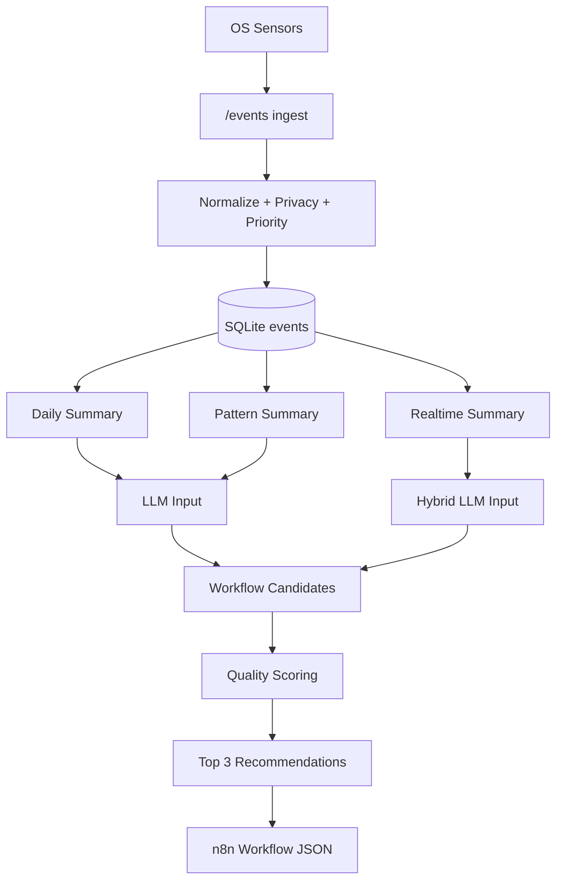
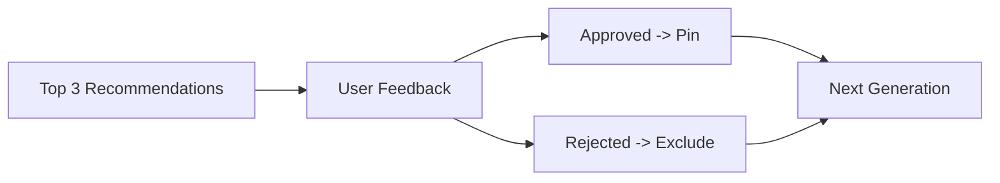

# 로컬 OS 자동화 워크플로우 (DCP + n8n)

이 프로젝트는 **Windows 환경에서 업무 활동 로그를 수집/요약하고, LLM 기반으로 n8n 워크플로우를 자동 생성/추천**하는 자동화 파이프라인입니다.  
데이터는 실시간으로 경량화되며, 추천 후보에 근거(패턴 기반 이유)를 붙이고 승인/거절 피드백을 반영해 개인화를 강화합니다.

---

## 핵심 목표
- 사용자 업무 패턴을 **정확히 요약/학습**
- **LLM 기반**으로 n8n 워크플로우 JSON을 생성
- 추천 → 피드백 → 재학습 루프를 통해 **초개인화 자동화** 달성

---

## 주요 기능
- Windows 센서 기반 이벤트 수집 (foreground, idle, file watcher)
- 개인정보 보호 규칙(allow/deny, 마스킹) 적용
- 실시간 요약 + 패턴 요약 + 하이브리드 LLM 입력 생성
- 워크플로우 후보 생성/점수화/Top3 추천
- 추천 결과 콘솔 요약 출력 + 승인/거절 피드백 반영
- 멀티 액션 팬아웃 (Notion/Slack/Gmail/Google Calendar)
- 승인 필요 시 false 분기 알림 자동 추가
- n8n CLI import 자동화 (REST API 없이도 동작)

---

## 아키텍처

```mermaid
flowchart TD
  S[OS Sensors] --> E["/events ingest"]
  E --> N[Normalize + Privacy + Priority]
  N --> DB[(SQLite events)]
  DB --> DS[Daily Summary]
  DB --> PS[Pattern Summary]
  DB --> RT[Realtime Summary]
  DS --> LLM[LLM Input]
  PS --> LLM
  RT --> LLMH[Hybrid LLM Input]
  LLM --> REC[Workflow Candidates]
  LLMH --> REC
  REC --> SCORE[Quality Scoring]
  SCORE --> TOP[Top 3 Recommendations]
  TOP --> WF[n8n Workflow JSON]
```


```mermaid
flowchart LR
  TOP[Top 3 Recommendations] --> FEED[User Feedback]
  FEED --> APPROVE[Approved -> Pin]
  FEED --> REJECT[Rejected -> Exclude]
  APPROVE --> NEXT[Next Generation]
  REJECT --> NEXT
```

---

## 폴더/파일 구조 (상세)

### 루트
```
C:\main
├─ README.md                  # 전체 개요/아키텍처/실행 방법
├─ .env                       # API 키/암호화 키(로컬 전용, gitignore)
├─ .gitignore                 # 빌드/로그/DB 등 제외 규칙
├─ docker-compose.yml         # n8n 컨테이너 구성
├─ scripts\                   # 실행/운영 스크립트
│  ├─ run_all.ps1              # 수집 + 센서 시작
│  ├─ run_live_pipeline.ps1    # 수집 + 요약 + 추천 + n8n import
│  ├─ run_post_and_import.ps1  # 배치 후처리 + import
│  ├─ n8n_bootstrap.ps1        # n8n Docker 부팅 + import
│  ├─ review_recommendations.ps1 # 추천 승인/거절/즉시 반영
│  ├─ set_privacy_level.ps1    # 개인정보 레벨 전환
│  ├─ set_privacy_level.py     # 개인정보 레벨 전환(내부 로직)
│  ├─ run_dcp.ps1              # 코어만 실행(레거시)
│  ├─ replay_events.ps1        # 이벤트 재생(PS)
│  ├─ replay_events.sh         # 이벤트 재생(*nix)
│  ├─ build_release.ps1        # 릴리즈 빌드(PS)
│  ├─ build_release.sh         # 릴리즈 빌드(*nix)
│  ├─ install_autostart.ps1    # 부팅 시 자동 실행 등록(PS)
│  ├─ install_autostart.sh     # 부팅 시 자동 실행 등록(*nix)
│  ├─ steer-guardian.ps1       # 보호/감시(레거시)
│  └─ steer-guardian.sh        # 보호/감시(*nix)
├─ collector\                  # 데이터 수집/요약/추천/워크플로우 생성
├─ apps\                       # (선택) 데스크톱/웹/코어 앱
├─ configs\                    # 루트 보조 설정(학습 프로필 등, gitignore)
├─ logs\                       # 로컬 로그(생성물, gitignore)
└─ n8n_data\                   # n8n Docker 볼륨(생성물, gitignore)
```

### collector\Data-Collection-Projection
```
collector\Data-Collection-Projection
├─ .gitignore                  # DCP 전용 제외 규칙
├─ requirements.txt            # Python 의존성
├─ collector.db                # 실데이터 이벤트 DB(로컬, gitignore)
├─ collector_summary.db        # 요약 DB(로컬, gitignore)
├─ browser_extension\          # 브라우저 컨텍스트 수집(확장)
│  ├─ manifest.json            # 확장 설정
│  ├─ background.js            # 백그라운드 수집 로직
│  └─ content.js               # 탭/페이지 컨텍스트 수집
├─ configs\                    # 설정/정책/점수 기준
│  ├─ config.yaml              # 실데이터 실행 설정
│  ├─ config_demo.yaml         # 데모 실행 설정
│  ├─ allowlist_selection.yaml # 앱/도메인 허용/차단 템플릿
│  ├─ personalization_demo.json# 개인화 기본 프로필
│  ├─ profile_learned.json     # 학습된 프로필(로컬)
│  ├─ privacy_rules.yaml       # 현재 적용중인 개인정보 규칙
│  ├─ privacy_rules_strict.yaml# 강함 규칙
│  ├─ privacy_rules_balanced.yaml # 균형 규칙
│  ├─ privacy_rules_permissive.yaml # 느슨함 규칙
│  └─ score_config.json        # 추천/워크플로우 점수 기준
├─ logs\                       # 실행 로그/요약/추천 결과(로컬)
├─ migrations\                 # DB 마이그레이션 SQL
├─ schemas\                    # 이벤트/추천/워크플로우 스키마
│  ├─ event.schema.json
│  ├─ event_types.yaml
│  ├─ n8n_workflow.schema.json
│  └─ recommendations.schema.json
├─ scripts\                    # 파이프라인/추천/유틸 스크립트
│  ├─ init_db.py               # DB 초기화/마이그레이션
│  ├─ build_daily_summary.py   # 일일 요약 생성
│  ├─ build_pattern_summary.py # 패턴 요약 생성
│  ├─ build_realtime_llm_input.py # 실시간 LLM 입력 생성
│  ├─ build_hybrid_llm_input.py # 실시간+패턴 하이브리드 입력
│  ├─ build_llm_input.py       # (레거시) LLM 입력 생성
│  ├─ generate_n8n_workflow.py # LLM → n8n 워크플로우 생성
│  ├─ generate_workflow_recommendations.py # 후보 생성/점수화/Top3
│  ├─ score_n8n_workflow.py    # 워크플로우 품질 점수
│  ├─ quality_dashboard.py     # 품질 대시보드 생성
│  ├─ partition_data_levels.py # raw/minimal/aggregated 분리
│  ├─ record_workflow_feedback.py # 승인/거절 기록
│  ├─ learn_profile.py         # 사용자 프로필 학습
│  ├─ recommend_patterns.py    # 패턴 기반 추천
│  ├─ report_patterns.py       # 패턴 리포트
│  ├─ analyze_patterns.py      # 패턴 분석
│  ├─ evaluate_pattern_quality.py # 패턴 품질 평가
│  ├─ send_n8n_workflow.py     # n8n로 워크플로우 전송
│  ├─ import_n8n_workflow.py   # n8n import 유틸
│  ├─ run_post_collection.ps1  # 후처리 배치 실행
│  ├─ run_quality_loop.ps1     # 품질 루프 실행
│  ├─ run_realtime_llm.ps1     # 실시간 LLM 입력 실행(레거시)
│  ├─ build_sessions.py        # 세션 단위 요약
│  ├─ build_routines.py        # 루틴 후보 생성
│  ├─ build_handoff.py         # 핸드오프 큐 생성
│  ├─ execute_recommendations.py # 추천 실행(자동화)
│  ├─ allowlist_wizard.py      # 허용/차단 목록 생성/적용
│  ├─ recommend_allowlist.py   # 허용 앱 추천
│  ├─ check_content_capture.py # 컨텐츠 캡처 점검
│  ├─ summarize_activity.py    # 활동 요약
│  ├─ show_activity_details.py # 상세 활동 표시
│  ├─ show_focus_titles.py     # 포커스 타이틀 확인
│  ├─ tail_events.py           # 이벤트 tail
│  ├─ print_stats.py           # 통계 출력
│  ├─ replay_events.py         # 이벤트 재생
│  ├─ replay_archive_events.py # 아카이브 재생
│  ├─ seed_dummy_data.py       # 더미 데이터 시드
│  ├─ generate_demo_events.py  # 데모 이벤트 생성
│  ├─ generate_demo_events_rich.py # 풍부한 데모 이벤트
│  ├─ generate_mock_events.py  # 목업 이벤트
│  ├─ generate_workflow.py     # 워크플로우 생성(레거시)
│  ├─ generate_workflow_with_retry.py # 워크플로우 재시도
│  ├─ generate_recommendations.py # 추천 생성(레거시)
│  ├─ send_patterns_to_n8n.py  # 패턴을 n8n로 전송
│  ├─ data_compressor.py       # 데이터 압축 유틸
│  ├─ retention_summary_only.py# 요약 중심 보존 정책
│  ├─ run_retention.py         # 보존 정책 실행
│  ├─ archive_raw_events.py    # raw 이벤트 아카이브
│  ├─ archive_daily.ps1        # 일간 아카이브
│  ├─ archive_monthly.ps1      # 월간 아카이브
│  ├─ archive_manifest.py      # 아카이브 manifest 생성
│  ├─ compact_archive_monthly.py # 월간 아카이브 압축
│  ├─ verify_archive_manifest.py # manifest 검증
│  ├─ install_archive_task.ps1 # 아카이브 스케줄 설치
│  ├─ uninstall_archive_task.ps1 # 아카이브 스케줄 제거
│  ├─ install_archive_monthly_task.ps1 # 월간 스케줄 설치
│  ├─ uninstall_archive_monthly_task.ps1 # 월간 스케줄 제거
│  ├─ install_service.ps1      # 서비스 설치
│  └─ uninstall_service.ps1    # 서비스 제거
├─ secrets\                    # 암호화 키 등(로컬)
├─ src\                        # Python 패키지
│  ├─ collector\               # 수집/정규화/저장/프라이버시
│  └─ sensors\                 # OS 센서(Windows)
├─ templates\                  # (예약) 템플릿 저장소
└─ tests\                      # 테스트
   ├─ fixtures\
   ├─ test_priority.py
   ├─ test_privacy.py
   ├─ test_replay_contract.py
   ├─ test_routine.py
   ├─ test_sessionizer.py
   ├─ test_input_hook.py
   └─ test_ui_automation.py
```

### apps (선택 구성)
```
apps
├─ core\                       # 로컬 OS 에이전트(Rust)
│  ├─ Cargo.toml / Cargo.lock  # Rust 빌드 설정
│  ├─ src\                     # 코어 로직
│  └─ daily_report_workflow.json # 예시 워크플로우
├─ desktop\                    # 데스크톱 UI(React/Tauri)
│  ├─ src\ / src-tauri\         # 앱 코드
│  ├─ index.html / main.js      # 엔트리
│  └─ package.json              # 프론트 의존성
└─ web\                         # 웹 UI(Vite/Tailwind)
   ├─ src\ / public\            # 프론트 코드
   └─ package.json              # 프론트 의존성
```

---

## 실행 환경
- Windows 10/11
- Python 3.11 (Conda)
- Docker Desktop (n8n)

---

## 설치
```powershell
conda create -n DATA_C python=3.11.14 -y
conda activate DATA_C
python -m pip install --upgrade pip
pip install -r collector\Data-Collection-Projection\requirements.txt
```

DB 초기화:
```powershell
conda run -n DATA_C python collector\Data-Collection-Projection\scripts\init_db.py --config collector\Data-Collection-Projection\configs\config.yaml
```

---

## 환경변수 (.env)
필수/권장:
```
OPENAI_API_KEY=...
DATA_COLLECTOR_ENC_KEY=...
```

DATA_COLLECTOR_ENC_KEY 생성 예시:
```powershell
$env:DATA_COLLECTOR_ENC_KEY = (python -c "from cryptography.fernet import Fernet; print(Fernet.generate_key().decode())")
```

n8n 기본 인증 (CLI import 용):
```
N8N_BASIC_AUTH_USER=admin
N8N_BASIC_AUTH_PASSWORD=admin123
```

---

## 실행 방법

### 1) 실데이터 수집
```powershell
conda activate DATA_C
cd C:\main
.\scripts\run_all.ps1 -TailLogs
```

### 2) 실시간 파이프라인 (수집 + 요약 + 추천 + import)
```powershell
.\scripts\run_live_pipeline.ps1
```

옵션:
```powershell
# 수집 프로세스 없이 파이프라인만
.\scripts\run_live_pipeline.ps1 -SkipCollector

# 공격적 경량화(요약 압축)
.\scripts\run_live_pipeline.ps1 -Aggressive

# 경량화 레벨/보존 필드(필드 보호)
.\scripts\run_live_pipeline.ps1 -CompressionLevel strict -PreserveFields "recent_events,top_titles,top_pages"

# 패턴 갱신 주기/윈도우 조정
.\scripts\run_live_pipeline.ps1 -PatternEveryMinutes 60 -PatternWindowDays 7

# Top1 자동 승인 (점수 + 조건)
.\scripts\run_live_pipeline.ps1 -AutoApprove `
  -AutoApproveMinScore 110 `
  -AutoApproveRequireSource llm `
  -AutoApproveMinToolMatches 1 `
  -AutoApproveRequireRationale `
  -AutoApproveRequireSequence

# 품질 대시보드/데이터 레벨 분리 비활성화
.\scripts\run_live_pipeline.ps1 -NoQualityDashboard -NoDataLevels
```

### 3) 후처리 + import (배치)
```powershell
.\scripts\run_post_and_import.ps1
```

---

## n8n 실행 + CLI import
```powershell
.\scripts\n8n_bootstrap.ps1
```
- 기본값은 **active=true로 자동 활성화**
- 비활성 import:
```powershell
.\scripts\n8n_bootstrap.ps1 -NoActivate
```
> 현재 운영은 CLI import만 사용합니다. (REST API 미사용)

---

## 데모 데이터 (실데이터와 분리)
데모는 별도 포트(8081)와 별도 DB를 사용합니다.

```powershell
conda run -n DATA_C python -m collector.main --config C:\main\collector\Data-Collection-Projection\configs\config_demo.yaml
```

데모 이벤트 생성/재생:
```powershell
conda run -n DATA_C python C:\main\collector\Data-Collection-Projection\scripts\generate_demo_events_rich.py `
  --days 7 --cycles 2 --output C:\main\collector\Data-Collection-Projection\logs\demo\demo_events_rich.jsonl

conda run -n DATA_C python C:\main\collector\Data-Collection-Projection\scripts\replay_events.py `
  --file C:\main\collector\Data-Collection-Projection\logs\demo\demo_events_rich.jsonl `
  --endpoint http://127.0.0.1:8081/events
```

---

## 추천/피드백 루프
추천 생성:
```powershell
conda run -n DATA_C python collector\Data-Collection-Projection\scripts\generate_workflow_recommendations.py `
  --config collector\Data-Collection-Projection\configs\config.yaml `
  --input collector\Data-Collection-Projection\logs\llm_input_hybrid.json `
  --output-dir collector\Data-Collection-Projection\logs `
  --profile collector\Data-Collection-Projection\configs\personalization_demo.json `
  --score-config collector\Data-Collection-Projection\configs\score_config.json `
  --include-template
```

피드백 기록:
```powershell
# 승인
conda run -n DATA_C python collector\Data-Collection-Projection\scripts\record_workflow_feedback.py --id <id> --status approved

# 거절
conda run -n DATA_C python collector\Data-Collection-Projection\scripts\record_workflow_feedback.py --id <id> --status rejected
```

추천 확인 + 승인/거절 + 즉시 반영(대화형):
```powershell
.\scripts\review_recommendations.ps1 -Apply
```

비대화형 승인 + 즉시 반영:
```powershell
.\scripts\review_recommendations.ps1 -Id <id> -Status approved -Apply
```

### 품질 대시보드
실행할 때마다 추천/점수/피드백/임포트 상태를 요약합니다.
```powershell
conda run -n DATA_C python collector\Data-Collection-Projection\scripts\quality_dashboard.py --log-dir collector\Data-Collection-Projection\logs
```
`run_live_pipeline.ps1` 실행 시 자동으로 생성됩니다. (비활성화: `-NoQualityDashboard`)
대시보드에는 **실패 원인(LLM 오류/파싱/임포트 실패)**과 **자동승인 사유 집계**도 포함됩니다.

### 데이터 레벨 분리 (raw/minimal/aggregated)
로그를 민감도 수준별로 분리 저장합니다.
```powershell
conda run -n DATA_C python collector\Data-Collection-Projection\scripts\partition_data_levels.py --log-dir collector\Data-Collection-Projection\logs
```
`run_live_pipeline.ps1` 실행 시 자동으로 생성됩니다. (비활성화: `-NoDataLevels`)

추천 결과:
- `logs/workflow_candidates.json` (후보 전체)
- `logs/workflow_recommendations.json` (Top3)
- `logs/workflow_recommendations.md` (근거 포함)
- `logs/n8n_workflow.json` (최종 import 대상)
- `logs/workflow_feedback_history.jsonl` (피드백 히스토리)
- `logs/quality_events.jsonl` (실패/자동승인 이벤트 로그)
  - 각 추천 항목에 `failure_summary`가 포함됩니다.

---

## 로그/저장 위치
- 실데이터 DB: `C:\main\collector\Data-Collection-Projection\collector.db`, `C:\main\collector\Data-Collection-Projection\collector_summary.db`
- 데모 DB: `C:\main\collector\Data-Collection-Projection\logs\demo\collector_demo.db`
- 실행 로그: `C:\main\collector\Data-Collection-Projection\logs\collector.log`
- 상세 활동 로그: `C:\main\collector\Data-Collection-Projection\logs\activity_detail.log`

---

## 개인정보/보안
`collector\Data-Collection-Projection\configs\privacy_rules.yaml` 기준으로 동작합니다.
- 민감 앱/도메인 denylist 적용
- URL/콘텐츠 마스킹
- raw_json 암호화

### 개인정보 보호 레벨 스위치
```powershell
# 강함(기본)
.\scripts\set_privacy_level.ps1 -Level strict

# 균형
.\scripts\set_privacy_level.ps1 -Level balanced

# 느슨함(디버그용)
.\scripts\set_privacy_level.ps1 -Level permissive
```
레벨 변경 후에는 실행 중인 프로세스를 재시작해야 적용됩니다.

---

## 트러블슈팅
- **콘솔에 로그가 안 찍힘**: `activity_to_console=false` 설정 때문입니다. 상세 로그는 `logs\activity_detail.log` 확인
- **LLM 응답 없음**: `.env`의 `OPENAI_API_KEY` 확인
- **n8n import 실패**: Docker Desktop 실행 여부 확인 후 `n8n_bootstrap.ps1` 재시도

---

## 현재 진행 상태
- Windows 수집 파이프라인 구축 완료
- 실시간 요약/패턴/추천 루프 작동
- n8n CLI import 자동화 완료
- 추천 후보 점수화/피드백 반영 루프 구축 완료
- 콘솔 추천 요약 + 자동 승인 옵션 추가

---

## 다음 고도화 아이디어
- Chrome 확장 기반 세부 컨텍스트(탭/도메인) 강화
- LLM 입력 품질 자동 교정
- 워크플로우 템플릿 라이브러리 확장
- 추천 품질 A/B 테스트 및 지표화

---

## 라이선스
팀 내부 프로젝트 기준. 외부 공개 시 별도 표기 필요.
