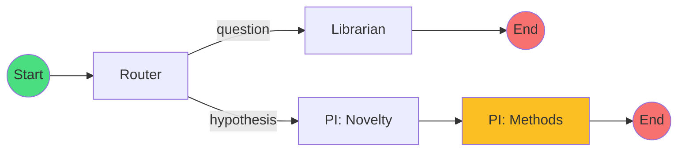
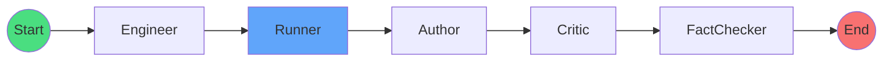

# 🏗️ T_lab 아키텍처 문서

> 이 문서는 T_lab 시스템의 기술 아키텍처를 시각적으로 설명합니다.

---

## 1. 시스템 아키텍처 개요

```
┌─────────────────────────────────────────────────────────────────────────────────┐
│                                 사용자                                          │
└─────────────────────────────────────┬───────────────────────────────────────────┘
                                      │
                                      ▼
┌─────────────────────────────────────────────────────────────────────────────────┐
│                           Frontend (Next.js 14)                                 │
│  ┌──────────────────────────────────────────────────────────────────────────┐  │
│  │                              page.tsx                                    │  │
│  │  ┌─────────┐  ┌─────────┐  ┌─────────────────┐  ┌─────────────────┐     │  │
│  │  │  Input  │→ │ Method  │→ │    Running      │→ │    Complete     │     │  │
│  │  │ Screen  │  │Selection│  │    Screen       │  │     Screen      │     │  │
│  │  └─────────┘  └─────────┘  │ ┌─────────────┐ │  └─────────────────┘     │  │
│  │                            │ │Design Card  │ │                          │  │
│  │                            │ │Console Log  │ │                          │  │
│  │                            │ │Live Charts  │ │                          │  │
│  │                            │ └─────────────┘ │                          │  │
│  │                            └─────────────────┘                          │  │
│  └──────────────────────────────────────────────────────────────────────────┘  │
│       │                          │                                             │
│       │ REST API               │ WebSocket (ws://localhost:8000/ws/...)       │
│       ▼                          ▼                                             │
└───────┼──────────────────────────┼─────────────────────────────────────────────┘
        │                          │
        │    HTTP / WebSocket     │
        ▼                          ▼
┌─────────────────────────────────────────────────────────────────────────────────┐
│                            Backend (FastAPI)                                    │
│  ┌─────────────────────────────────────────────────────────────────────────┐   │
│  │                              main.py                                    │   │
│  │  ┌─────────────────┐  ┌─────────────────┐  ┌─────────────────┐         │   │
│  │  │  REST Endpoints │  │  WebSocket      │  │ PersistentStore │         │   │
│  │  │  /research/*    │  │  /ws/research/* │  │  (Session CRUD) │         │   │
│  │  └────────┬────────┘  └────────┬────────┘  └────────┬────────┘         │   │
│  │           │                    │                    │                   │   │
│  │           ▼                    ▼                    ▼                   │   │
│  │  ┌──────────────────────────────────────────────────────────────┐      │   │
│  │  │                      workflow.py                             │      │   │
│  │  │                 (LangGraph Orchestrator)                     │      │   │
│  │  │  ┌─────────┐  ┌─────────┐  ┌─────────┐  ┌─────────┐         │      │   │
│  │  │  │ Router  │→ │Librarian│→ │   PI    │→ │Engineer │         │      │   │
│  │  │  └─────────┘  └─────────┘  └─────────┘  └─────────┘         │      │   │
│  │  │       ↓              ↓           ↓            ↓              │      │   │
│  │  │  ┌─────────┐  ┌─────────┐  ┌─────────┐  ┌─────────┐         │      │   │
│  │  │  │ Runner  │→ │ Author  │→ │ Critic  │→ │FactChk │         │      │   │
│  │  │  └─────────┘  └─────────┘  └─────────┘  └─────────┘         │      │   │
│  │  └──────────────────────────────────────────────────────────────┘      │   │
│  └─────────────────────────────────────────────────────────────────────────┘   │
│                                    │                                           │
│                                    ▼                                           │
│  ┌─────────────────────────────────────────────────────────────────────────┐   │
│  │                         SQLite Database                                 │   │
│  │                           (t_lab.db)                                    │   │
│  └─────────────────────────────────────────────────────────────────────────┘   │
└─────────────────────────────────────────────────────────────────────────────────┘
                    │                                    │
                    ▼                                    ▼
         ┌────────────────┐                   ┌────────────────┐
         │ Semantic Scholar │                   │      arXiv     │
         │      API        │                   │      API       │
         └────────────────┘                   └────────────────┘
                    │                                    │
                    └──────────────┬─────────────────────┘
                                   ▼
                          ┌────────────────┐
                          │   OpenAI API   │
                          │   (GPT-4o)     │
                          └────────────────┘
```

---

## 2. LangGraph 워크플로우

### 2.1 Research Graph (초기 분석)



### 2.2 Execution Graph (실험 수행)



---

## 3. 에이전트 레이어

```
┌─────────────────────────────────────────────────────────────────┐
│                        Agent Layer                              │
├─────────┬─────────┬─────────┬─────────┬─────────┬─────────────┤
│ Router  │Librarian│   PI    │Engineer │ Runner  │   Author    │
│         │         │         │         │         │             │
│ Intent  │ Search  │ Design  │ Code    │ Monte   │ IMRAD       │
│ Classify│ Papers  │ H₀/H₁   │ Gen/Run │ Carlo   │ Report      │
├─────────┴─────────┴─────────┴─────────┴─────────┴─────────────┤
│                                                                 │
│  ┌─────────┐  ┌─────────┐  ┌─────────────┐                     │
│  │ Critic  │  │FactChk  │  │ Synthesizer │                     │
│  │         │  │         │  │             │                     │
│  │ Review  │  │ Verify  │  │ Meta-Analysis                     │
│  │ Report  │  │ DOI/arX │  │ (Multi-Session)                   │
│  └─────────┘  └─────────┘  └─────────────┘                     │
└─────────────────────────────────────────────────────────────────┘
                              │
                              ▼
┌─────────────────────────────────────────────────────────────────┐
│                        Tool Layer                               │
├─────────────┬─────────────┬─────────────┬─────────────────────┤
│ LLM (GPT-4o)│ External API │ Python Exec │ PDF Generator       │
│             │ (S2/arXiv)   │ (sandbox)   │ (ReportLab)         │
└─────────────┴─────────────┴─────────────┴─────────────────────┘
```

---

## 4. 데이터 모델

### 4.1 ScientificState (글로벌 상태)

```
ScientificState
├── session_id: str
├── user_input: str
├── domain: str
├── status: "running" | "paused" | "completed" | "failed"
│
├── intent: "hypothesis" | "question"
├── intent_confidence: float
│
├── literature_context: List[Paper]
│   └── Paper { title, abstract, year, doi, arxiv_id, citation_count }
│
├── novelty_score: float
├── proposed_methods: List[Method]
│   └── Method { title, type, description, methodology, pros, cons, hypothesis }
│       └── hypothesis { h0, h1 }
│
├── selected_method: Method
│
├── experiment_code: str
├── experiment_results: { success, output, error }
│
├── simulation_params: SimulationParams
│   ├── control_group_mean/std
│   ├── experimental_group_mean/std
│   ├── sample_size
│   ├── effect_size
│   ├── literature_supports: bool
│   └── contradiction_reason: str | null
│
├── simulation_results: SimulationResults
│   ├── p_value
│   ├── significant_difference
│   └── control_stats, experimental_stats
│
├── final_report: str (Markdown)
└── activity_log: List[{ time, agent, message }]
```

---

## 5. API 엔드포인트 맵

```
                    FastAPI Router
                         │
         ┌───────────────┼───────────────┐
         │               │               │
         ▼               ▼               ▼
    /research/*      /sessions/*      /papers/*
         │               │               │
    ┌────┴────┐     ┌────┴────┐         │
    │         │     │         │         │
/start   /select  /{id}   /{id}/      /synthesize
    │    -method  │     download        │
    │         │     │         │         │
    ▼         ▼     ▼         ▼         ▼
 [POST]   [POST]  [GET]    [GET]     [POST]
```

---

## 6. WebSocket 통신

```
Client                                Server
   │                                     │
   ├── Connect ──────────────────────────→
   │   ws://localhost:8000/ws/research/{sid}
   │                                     │
   │←─── {"type":"log","agent":"Router"} ─┤
   │←─── {"type":"log","agent":"PI"} ─────┤
   │←─── {"type":"log","message":"H₀:..."} ┤
   │                                     │
   │←─── {"type":"data_point",          ─┤
   │      "iteration": 10,               │
   │      "p_value": 0.234,              │
   │      "power": 0.45 }                │
   │                                     │
   │←─── {"type":"data_point", ...} ─────┤
   │                                     │
   ├── Close ────────────────────────────→
```

---

## 7. 배포 아키텍처 (Docker)

```
┌─────────────────────────────────────────┐
│              docker-compose             │
├─────────────────────────────────────────┤
│                                         │
│  ┌─────────────────┐  ┌──────────────┐ │
│  │   api (8000)    │  │  web (3001)  │ │
│  │   FastAPI       │  │   Next.js    │ │
│  │   + LangGraph   │  │              │ │
│  └────────┬────────┘  └──────┬───────┘ │
│           │                  │          │
│           └────────┬─────────┘          │
│                    │                    │
│           ┌────────▼────────┐           │
│           │    volumes      │           │
│           │  ./t_lab.db     │           │
│           │  ./static       │           │
│           │  ./reports      │           │
│           └─────────────────┘           │
└─────────────────────────────────────────┘
```

---

## 8. 보안 고려사항

| 항목 | 현재 상태 | 권장 사항 |
|------|----------|----------|
| API Key | 환경변수 | Secrets Manager 사용 |
| CORS | localhost 허용 | 프로덕션에서 도메인 제한 |
| Code Execution | RestrictedPython | 컨테이너 샌드박스 강화 |
| Database | SQLite (로컬) | PostgreSQL + 암호화 |
| WebSocket | 인증 없음 | JWT 토큰 검증 추가 |

---

> 🏗️ **T_lab Architecture Document** - v1.2
