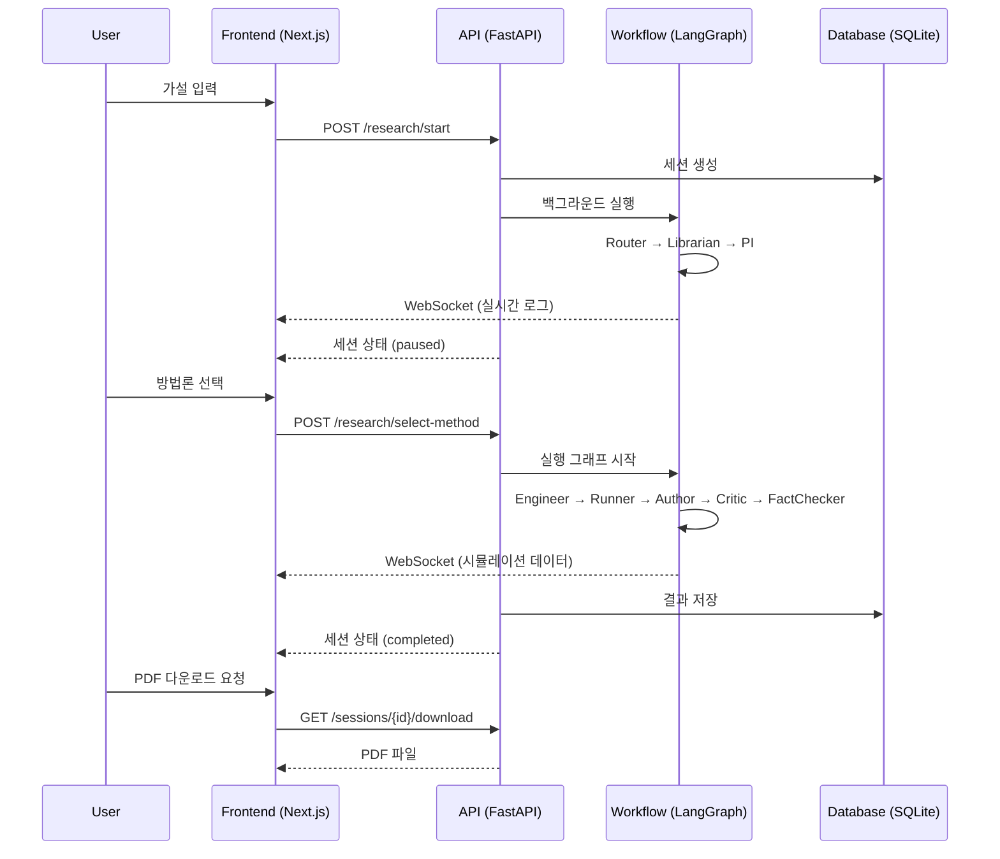
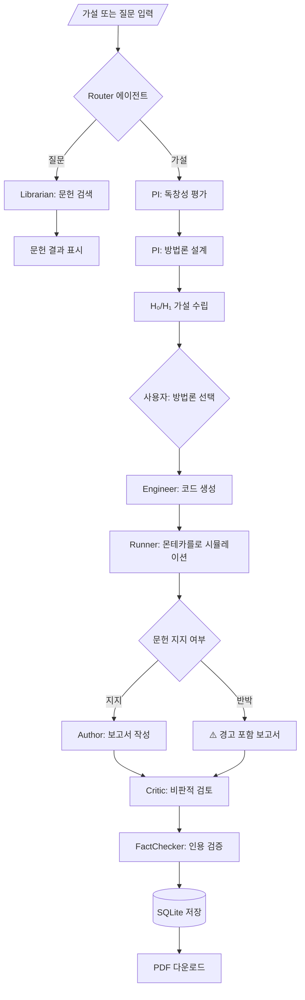

# 🔬 T_lab - AI-Powered Virtual Research Laboratory

> **프로젝트명**: T_lab (Unified Virtual Lab)  
> **버전**: 1.2 Gold Edition (Literature-Validated Hypothesis Testing)  
> **최종 업데이트**: 2026-01-28

---

## 📋 목차

1. [개요](#1-개요)
2. [시스템 아키텍처](#2-시스템-아키텍처)
3. [워크플로우 상세](#3-워크플로우-상세)
4. [멀티 에이전트 시스템](#4-멀티-에이전트-시스템)
5. [디렉토리 구조](#5-디렉토리-구조)
6. [API 명세](#6-api-명세)
7. [데이터베이스 스키마](#7-데이터베이스-스키마)
8. [설치 및 실행](#8-설치-및-실행)
9. [기술 스택](#9-기술-스택)

---

## 1. 개요

### 1.1 시스템 목표

T_lab은 사용자의 **가설 또는 질문**을 입력받아 → 문헌 분석 → 방법론 설계 → 가상 실험(시뮬레이션) 수행 → 학술 보고서 자동 생성까지 **자율 수행**하는 AI 연구 동료 시스템입니다.

### 1.2 핵심 기능

| 기능 | 설명 |
|------|------|
| 🔍 **의도 분류** | 질문(Question) vs 가설(Hypothesis) 자동 분류 |
| 📚 **문헌 검색** | Semantic Scholar + arXiv API 통합 검색 |
| 🧪 **연구 설계** | H₀/H₁ 가설 수립 + 3가지 방법론 제안 |
| 📊 **몬테카를로 시뮬레이션** | 실시간 P-value, Power, Effect Size 계산 |
| ⚠️ **문헌 기반 검증** | 기존 연구와 상충 시 경고 표시 |
| 📝 **IMRAD 보고서** | 학술 형식 보고서 + PDF 다운로드 |
| 🔄 **실시간 스트리밍** | WebSocket을 통한 실시간 진행 상황 표시 |

### 1.3 핵심 차별점

| 기존 시스템 | T_lab |
|------------|-------|
| 단순 QA (검색 후 요약) | **가상 실험 수행** (코드 생성 + 시뮬레이션) |
| 가설 무조건 지지 | **문헌 기반 검증** (반박 시 경고) |
| 단순 결과 제시 | **검정력(1-β) & 효과 크기(d) 분석** |
| 정적 대기 | **WebSocket 실시간 스트리밍** |

---

## 2. 시스템 아키텍처

### 2.1 전체 아키텍처

```
┌─────────────────────────────────────────────────────────────────────────────┐
│                              CLIENT (Next.js 14)                            │
│  ┌─────────────┐  ┌─────────────┐  ┌─────────────┐  ┌─────────────┐        │
│  │   Input     │  │   Method    │  │  Running    │  │  Complete   │        │
│  │   Screen    │→ │  Selection  │→ │   Screen    │→ │   Screen    │        │
│  └─────────────┘  └─────────────┘  └──────┬──────┘  └──────┬──────┘        │
│                                           │                 │               │
│                    WebSocket ─────────────┘                 │               │
│                    (실시간 로그/차트)                        │               │
└─────────────────────────────────────────────────────────────┼───────────────┘
                                                              │
                              REST API / WebSocket            │
                                                              ▼
┌─────────────────────────────────────────────────────────────────────────────┐
│                            BACKEND (FastAPI)                                │
│  ┌────────────────────────────────────────────────────────────────┐        │
│  │                      LangGraph Workflow                        │        │
│  │  ┌─────────┐    ┌─────────┐    ┌─────────┐    ┌─────────┐     │        │
│  │  │ Router  │ →  │Librarian│ →  │   PI    │ →  │ Critic  │     │        │
│  │  └─────────┘    └─────────┘    └─────────┘    └─────────┘     │        │
│  │       │              │              │              │          │        │
│  │       ▼              ▼              ▼              ▼          │        │
│  │  ┌─────────┐    ┌─────────┐    ┌─────────┐    ┌─────────┐     │        │
│  │  │Engineer │ →  │ Runner  │ →  │ Author  │ →  │FactChk │     │        │
│  │  └─────────┘    └─────────┘    └─────────┘    └─────────┘     │        │
│  └────────────────────────────────────────────────────────────────┘        │
│                                    │                                       │
│                                    ▼                                       │
│  ┌─────────────────────────────────────────────────────────────────┐       │
│  │                    SQLite Database (t_lab.db)                   │       │
│  │    sessions / activity_log / simulation_params / reports       │       │
│  └─────────────────────────────────────────────────────────────────┘       │
└─────────────────────────────────────────────────────────────────────────────┘
```

### 2.2 데이터 흐름



---

## 3. 워크플로우 상세

### 3.1 전체 워크플로우



### 3.2 두 개의 LangGraph 그래프

#### Research Graph (초기 분석)
```
Entry → Router → [Librarian(질문) | PI_Novelty(가설)]
PI_Novelty → PI_Methods → END (사용자 선택 대기)
```

#### Execution Graph (실험 수행)
```
Entry → Engineer → Runner → Author → Critic → FactChecker → END
```

### 3.3 Global State Schema

```python
class ScientificState(TypedDict):
    # Session
    session_id: str              # 세션 고유 식별자
    user_input: str              # 사용자 입력 (가설/질문)
    domain: str                  # 연구 도메인
    status: str                  # running | paused | completed | failed
    
    # Intent Classification
    intent: str                  # hypothesis | question
    intent_confidence: float     # 분류 신뢰도 (0.0-1.0)
    
    # Literature
    literature_context: List[Dict]  # 검색된 논문 목록
    search_queries: List[str]       # 변환된 검색 쿼리
    
    # Research Design
    novelty_score: float         # 독창성 점수 (0.0-1.0)
    proposed_methods: List[Dict] # 제안된 3가지 방법론
    selected_method: Dict        # 선택된 방법론 (H₀, H₁ 포함)
    
    # Experiment
    experiment_code: str         # 생성된 Python 코드
    experiment_results: Dict     # 코드 실행 결과
    
    # Simulation
    simulation_params: Dict      # 시뮬레이션 파라미터
      # - control_group_mean/std
      # - experimental_group_mean/std
      # - sample_size, effect_size
      # - literature_supports: bool
      # - contradiction_reason: str
    simulation_results: Dict     # 시뮬레이션 결과
      # - p_value, significant_difference
      # - control_stats, experimental_stats
    
    # Report
    draft_report: str            # 초안 보고서
    final_report: str            # 최종 보고서 (Markdown)
    report_path: str             # 저장된 보고서 경로
    
    # Activity
    activity_log: List[Dict]     # 실시간 활동 로그
    current_step: str            # 현재 단계
    current_step_label: str      # 사용자 표시용 단계 라벨
    logic_chain: List[Dict]      # 논리 체인 기록
```

---

## 4. 멀티 에이전트 시스템

### 4.1 에이전트 개요

| # | Agent | 역할 | 입력 | 출력 | 주요 도구 |
|---|-------|------|------|------|----------|
| 1 | **Router** | 입력 의도 분류 | user_input | intent, confidence | Zero-Shot Classifier |
| 2 | **Librarian** | 학술 문헌 검색 | query | literature_context | Semantic Scholar, arXiv |
| 3 | **PI** | 연구 설계 | hypothesis, literature | methods, H₀/H₁ | GPT-4o |
| 4 | **Critic** | 비판적 검토 | report | critiques | Adversarial Prompt |
| 5 | **Engineer** | 코드 생성/실행 | method | experiment_code | Python Sandbox |
| 6 | **Runner** | 시뮬레이션 실행 | params | simulation_results | NumPy, SciPy |
| 7 | **Author** | 보고서 작성 | all_data | final_report | Markdown Generator |
| 8 | **FactChecker** | 인용 검증 | report | verified_report | DOI Resolver |
| 9 | **Synthesizer** | 논문 합성 | sessions[] | synthesized_paper | Meta-Analysis |
| 10 | **Preregistrar** | 연구 계획 잠금 | plan | locked_plan | (비활성화) |

### 4.2 에이전트 상세

#### Router Agent (`agents/router.py`)
```python
def classify_intent(state: ScientificState) -> ScientificState:
    """
    사용자 입력이 '가설'인지 '질문'인지 분류
    
    분류 기준:
    - hypothesis: "~한다", "~증가시킨다", "~효과가 있다" 등 검증 가능한 주장
    - question: "무엇인가?", "왜?", "어떻게?" 등 정보 요청
    
    Returns:
        intent: "hypothesis" | "question"
        intent_confidence: 0.0-1.0
    """
```

#### Librarian Agent (`agents/librarian.py`)
```python
class LibrarianAgent:
    """
    학술 문헌 검색 에이전트
    
    검색 소스:
    - Semantic Scholar (S2 API)
    - arXiv
    
    기능:
    - 한글 쿼리 → 영어 키워드 변환 (LLM)
    - 중복 제거 및 통합
    """
    
    S2_API_URL = "https://api.semanticscholar.org/graph/v1/paper/search"
    ARXIV_API_URL = "http://export.arxiv.org/api/query"
```

#### PI Agent (`agents/pi.py`)
```python
class PIAgent:
    """
    Principal Investigator (책임연구원) 에이전트
    
    역할:
    1. 가설 독창성 평가 (novelty_score)
    2. 3가지 연구 방법론 제안:
       - Analytical (이론적 분석)
       - Simulation (시뮬레이션)
       - Data-Driven (데이터 기반)
    3. 각 방법론에 H₀/H₁ 가설 명시
    """
```

#### Experiment Runner Agent (`agents/experiment_runner.py`)
```python
class ExperimentRunnerAgent:
    """
    시뮬레이션 실행 에이전트 (Monte Carlo)
    
    핵심 기능:
    1. 문헌 기반 파라미터 추출 (LLM)
    2. Sequential Analysis (T-Test)
    3. 실시간 WebSocket 스트리밍:
       - iteration, p_value, power, effect_size
    4. 문헌 반박 시 경고 생성:
       - literature_supports: false
       - contradiction_reason: "..."
    
    파라미터:
    - control_group_mean/std
    - experimental_group_mean/std
    - sample_size (N)
    - effect_size (Cohen's d)
    """
```

#### Author Agent (`agents/author.py`)
```python
class AuthorAgent:
    """
    보고서 작성 에이전트
    
    형식: IMRAD
    1. 초록 (Abstract)
    2. 서론 (Introduction)
       - ⚠️ 문헌 경고 (literature_supports=false 시)
    3. 방법 (Methods)
    4. 결과 (Results)
       - 시각화 이미지 포함
    5. 고찰 (Discussion)
    6. 결론 (Conclusion)
    """
```

---

## 5. 디렉토리 구조

```
T_lab/
├── README.md                    # 프로젝트 문서 (이 파일)
├── STRUCTURE.md                 # 간략 구조 문서
├── docker-compose.yml           # Docker 설정
├── t_lab.db                     # SQLite 데이터베이스
│
├── apps/
│   ├── api/                     # Backend (FastAPI)
│   │   ├── main.py              # 메인 앱 + API 엔드포인트
│   │   ├── workflow.py          # LangGraph 워크플로우 정의
│   │   ├── state.py             # ScientificState 정의
│   │   ├── models.py            # SQLAlchemy 모델
│   │   ├── connection_manager.py # WebSocket 관리
│   │   │
│   │   ├── agents/              # 에이전트 모듈
│   │   │   ├── router.py        # 의도 분류
│   │   │   ├── librarian.py     # 문헌 검색
│   │   │   ├── pi.py            # 연구 설계
│   │   │   ├── engineer.py      # 코드 생성
│   │   │   ├── experiment_runner.py  # 시뮬레이션
│   │   │   ├── author.py        # 보고서 작성
│   │   │   ├── critic.py        # 비판적 검토
│   │   │   ├── fact_checker.py  # 인용 검증
│   │   │   ├── paper_synthesizer.py  # 논문 합성
│   │   │   └── preregistrar.py  # (비활성화)
│   │   │
│   │   ├── core/                # 핵심 유틸리티
│   │   │   ├── config.py        # 설정 (Settings)
│   │   │   ├── database.py      # DB 연결
│   │   │   └── logging.py       # 로거
│   │   │
│   │   ├── tools/               # 도구 모듈
│   │   ├── static/              # 생성된 이미지
│   │   ├── reports/             # 저장된 보고서
│   │   └── tmp_pdfs/            # PDF 임시 파일
│   │
│   └── web/                     # Frontend (Next.js 14)
│       ├── src/
│       │   ├── app/
│       │   │   ├── page.tsx     # 메인 페이지
│       │   │   ├── page.module.css
│       │   │   ├── layout.tsx
│       │   │   ├── experiments/ # 실험 상세 페이지
│       │   │   └── papers/      # 논문 합성 페이지
│       │   │
│       │   ├── components/      # React 컴포넌트
│       │   │   ├── SimulationChart.tsx
│       │   │   └── ExperimentReport.tsx
│       │   │
│       │   └── lib/
│       │       └── api/
│       │           └── client.ts    # API 클라이언트 + 타입 정의
│       │
│       ├── next.config.mjs
│       └── package.json
│
└── scripts/
    └── init_db.py               # DB 초기화 스크립트
```

---

## 6. API 명세

### 6.1 REST API

| Method | Endpoint | Description |
|--------|----------|-------------|
| GET | `/health` | 헬스 체크 |
| POST | `/research/start` | 연구 시작 |
| POST | `/research/select-method` | 방법론 선택 |
| GET | `/sessions` | 세션 목록 |
| GET | `/sessions/{id}` | 세션 상세 |
| DELETE | `/sessions/{id}` | 세션 삭제 |
| GET | `/sessions/{id}/download` | PDF 다운로드 |
| POST | `/papers/synthesize` | 논문 합성 |

### 6.2 WebSocket

| Endpoint | Description |
|----------|-------------|
| `ws://localhost:8000/ws/research/{session_id}` | 실시간 로그/데이터 스트리밍 |

**메시지 형식:**

```json
// 로그 메시지
{
  "type": "log",
  "timestamp": "10:30:45",
  "agent": "PI",
  "message": "📋 방법론 1: Monte Carlo Simulation"
}

// 시뮬레이션 데이터
{
  "type": "data_point",
  "iteration": 50,
  "p_value": 0.0342,
  "power": 0.75,
  "effect_size": 0.45
}
```

### 6.3 Request/Response 예시

#### POST `/research/start`
```json
// Request
{
  "user_input": "카페인이 집중력을 향상시킨다",
  "domain": "심리학"
}

// Response
{
  "session_id": "abc123-...",
  "status": "running",
  "intent": "hypothesis"
}
```

#### POST `/research/select-method`
```json
// Request
{
  "session_id": "abc123-...",
  "method_index": 1
}

// Response
{
  "session_id": "abc123-...",
  "status": "running",
  "selected_method": {
    "title": "Monte Carlo Simulation",
    "hypothesis": {
      "h0": "카페인은 집중력에 영향을 미치지 않는다",
      "h1": "카페인은 집중력을 유의하게 향상시킨다"
    }
  }
}
```

---

## 7. 데이터베이스 스키마

### 7.1 sessions 테이블

```sql
CREATE TABLE sessions (
    id INTEGER PRIMARY KEY AUTOINCREMENT,
    session_id TEXT UNIQUE NOT NULL,
    user_input TEXT NOT NULL,
    domain TEXT DEFAULT '',
    status TEXT DEFAULT 'running',
    intent TEXT,
    intent_confidence REAL,
    novelty_score REAL,
    novelty_reasoning TEXT,
    literature_context JSON,
    search_queries JSON,
    proposed_methods JSON,
    selected_method JSON,
    selected_method_index INTEGER,
    experiment_code TEXT,
    experiment_results JSON,
    simulation_params JSON,
    simulation_results JSON,
    draft_report TEXT,
    final_report TEXT,
    report_path TEXT,
    activity_log JSON,
    current_step TEXT,
    current_step_label TEXT,
    logic_chain JSON,
    error TEXT,
    created_at DATETIME DEFAULT CURRENT_TIMESTAMP,
    updated_at DATETIME DEFAULT CURRENT_TIMESTAMP
);
```

---

## 8. 설치 및 실행

### 8.1 환경 요구사항

- Python 3.11+
- Node.js 18+
- OpenAI API Key

### 8.2 Backend 설정

```bash
cd apps/api

# 가상환경 생성
python -m venv venv
source venv/bin/activate  # Windows: venv\Scripts\activate

# 의존성 설치
pip install -r requirements.txt

# 환경변수 설정
cp .env.example .env
# .env 파일에 OPENAI_API_KEY 입력

# 서버 실행
uvicorn main:app --host 0.0.0.0 --port 8000 --reload
```

### 8.3 Frontend 설정

```bash
cd apps/web

# 의존성 설치
npm install

# 개발 서버 실행
npm run dev  # http://localhost:3001
```

### 8.4 Docker 실행 (선택)

```bash
docker-compose up --build
```

---

## 9. 기술 스택

```yaml
Backend:
  Framework: FastAPI 0.109+
  Agent Orchestration: LangGraph
  LLM: OpenAI GPT-4o
  Database: SQLite + SQLAlchemy
  PDF Generation: ReportLab (한글 지원)
  WebSocket: FastAPI WebSocket

Frontend:
  Framework: Next.js 14 (App Router)
  Styling: CSS Modules
  Charts: Recharts
  Markdown: react-markdown + remark-gfm
  HTTP Client: fetch API

External APIs:
  - Semantic Scholar API
  - arXiv API
  - OpenAI API
```

---

## 📊 참고사항

- 본 시스템은 **가상 실험**을 수행하며, 실제 실험 데이터가 아닌 **시뮬레이션 결과**를 제공합니다.
- 문헌 기반 검증 기능을 통해 기존 과학적 합의와 상충되는 가설에 대해 경고를 표시합니다.
- PDF 보고서에는 한글 폰트(NanumGothic)와 실험 결과 시각화가 포함됩니다.

---

> 🔬 **T_lab v1.2 Gold Edition** - AI-Powered Virtual Research Laboratory
