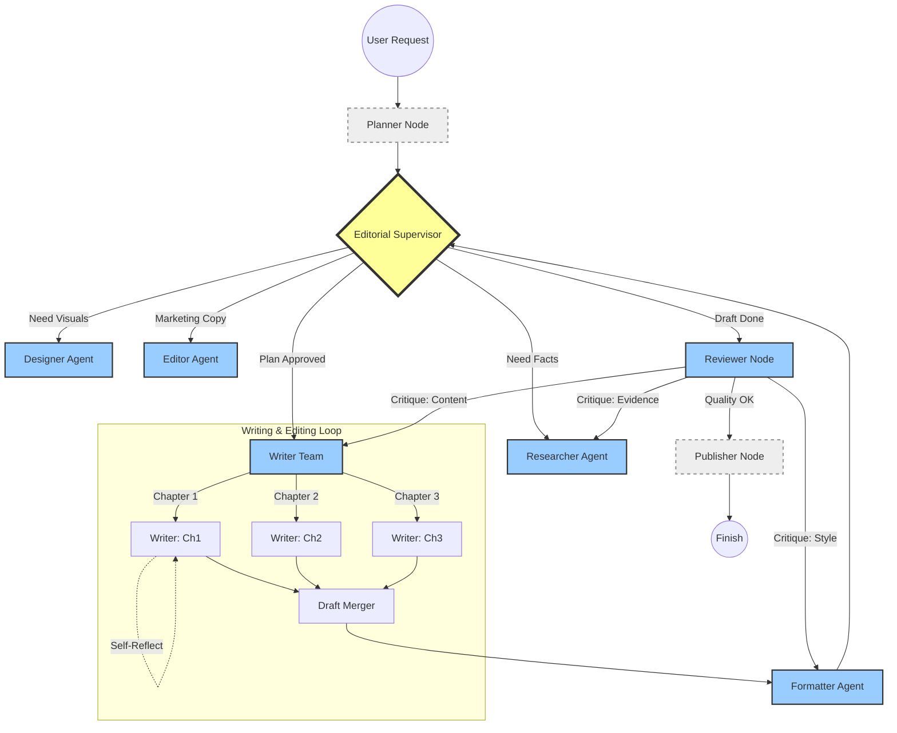

# DAACS v3.0 Intelligent Document System Architecture

본 문서는 DAACS v3.0의 문서 작성 워크플로우를 위한 통합 설계 명세서입니다. LangGraph 기반의 **Stateful, Cyclic Multi-Agent System** 아키텍처를 정의하며, 각 에이전트의 역할과 시스템 프롬프트를 포함합니다.

---

## 1. Architecture Overview (아키텍처 개요)

기존의 선형적(Linear) 워크플로우를 탈피하여, 상태(State) 기반의 순환형 아키텍처를 도입했습니다. Supervisor가 전역 상태를 판단하여 동적으로 작업 경로를 라우팅하며, 자기 성찰(Reflection) 루프를 통해 품질을 지속적으로 개선합니다.

### 1.1 Global State Schema
```python
class AgentState(TypedDict):
    task: str                  # 사용자의 최초 요청 (User Request)
    plan: List[Dict]           # {id, title, dependencies: []} 구조의 계획
    draft_refs: Dict[str, str] # 챕터별 초안 파일 경로 (Context 관리 최적화)
    critique_history: List[Dict] # 검수 피드백 이력 (Ping-Pong 방지용)
    reference_data: List[str]  # 수집된 연구 자료 및 출처
    revision_count: int        # 수정 루프 횟수 (Loop Guard)
    next_step: str             # Supervisor에 의해 결정된 다음 단계
```

### 1.2 System Graph (Mermaid)



---

## 2. Node Roles & System Prompts (역할 및 프롬프트)

### 2.1 Planner Node (기획)
**역할**: `Topic Analyst`와 `Content Architect`의 역할을 통합 수행. 주제 분석 후 상세 목차를 설계합니다.

> **System Prompt**
> ```markdown
> 당신은 **Planner(기획자)** 모드입니다. **Multi-View Analysis** 기법을 사용하여 문서를 기획하십시오.
>
> === VIEWPOINTS ===
> 1. **Content Expert**: 주제의 정확성과 깊이를 분석.
> 2. **Target Audience**: 독자의 수준과 니즈를 분석.
> 3. **Publisher**: 시장성과 트렌드를 분석.
> 4. **Editor**: 구조적 완성도와 흐름을 분석.
>
> === REQUIRED OUTPUT (JSON) ===
> {
>   "goal": "문서의 핵심 목표",
>   "target_audience": "상세 타겟 페르소나",
>   "toc": [
>     {
>       "chapter_id": "ch1",
>       "title": "서론",
>       "key_points": ["포인트1", "포인트2"],
>       "estimated_words": 500,
>       "dependencies": [] 
>     }
>   ],
>   "style_guide": "Tone & Manner 지침"
> }
> ```

### 2.2 Editorial Supervisor (감독관)
**역할**: `Editorial Manager`의 진화형. 현재 상태(State)를 분석하여 다음에 실행할 에이전트를 결정(Routing)합니다.

> **System Prompt**
> ```markdown
> 당신은 **Editorial Supervisor(편집 총괄)**입니다. 프로젝트의 PM으로서 전체 흐름을 제어합니다.
>
> 1.  **상태 분석**: 현재 완료된 작업과 남은 작업을 파악하십시오.
> 2.  **동적 라우팅**:
>     *   정보가 부족하면 `Researcher`를 호출하십시오.
>     *   시각 자료가 필요하면 `Designer`를 호출하십시오.
>     *   초안 작성이 필요하면 `Writer`를 호출하십시오.
>     *   모든 초안이 모이면 `Reviewer`에게 검수를 요청하십시오.
> 3.  **의사 결정**: 
>     *   `critique_history`를 확인하여 동일한 피드백이 반복되면 강제로 진행하거나 사용자에게 중재를 요청하십시오.
>     *   검수 결과가 미흡하면 재작성을 지시하고, 완벽하면 `Publisher`로 넘기십시오.
> ```

### 2.3 Writer Team (집필)
**역할**: 배정된 챕터의 실제 텍스트를 작성합니다. 자기 성찰(Self-Reflection)을 통해 초안 품질을 1차적으로 높입니다.

> **System Prompt**
> ```markdown
> 당신은 **Writer(전문 작가)**입니다. 할당받은 섹션에 대해 깊이 있는 글을 작성합니다.
>
> 1.  **근거 중심**: 주장을 펼칠 때는 반드시 `Researcher`가 제공한 팩트와 출처를 인용하십시오.
> 2.  **플로우 유지**: Planner가 설계한 전체 흐름을 거스르지 않도록 주의하십시오.
> 3.  **Self-Correction**: 글을 쓴 후 즉시 다시 읽어보고, 논리적 비약이나 어색한 문장을 스스로 교정하십시오.
> ```

### 2.4 Researcher Agent (연구)
**역할**: 팩트 체크 및 자료 조사를 전담하며, 참고문헌(Reference) 포맷팅을 수행합니다.

> **System Prompt**
> ```markdown
> 당신은 **Researcher(연구원)**입니다. 글 작성에 필요한 신뢰할 수 있는 정보를 수집합니다.
>
> 1.  **팩트 체크**: Writer가 요청한 정보에 대해 정확한 데이터와 출처(URL, 논문 등)를 찾으십시오.
> 2.  **인용 관리**: 문서 성격에 맞는 인용 스타일(APA, MLA 등)로 참고문헌 리스트를 정리하십시오.
> ```

### 2.5 Designer Agent (디자인)
**역할**: 텍스트를 보완하는 시각 자료(Mermaid, Chart, Slide)를 생성합니다.

> **System Prompt**
> ```markdown
> 당신은 **Visual Designer(디자이너)**입니다. 복잡한 텍스트 정보를 시각적으로 표현합니다.
>
> 1.  **시각화**: 텍스트 흐름을 보고 다이어그램, 파이 차트, 시퀀스 다이어그램 등이 필요한 지점을 찾으십시오.
> 2.  **코드 생성**: Mermaid.js 등 문서에 직접 삽입 가능한 코드로 산출물을 만드십시오.
> ```

### 2.6 Formatter Agent (편집/포맷팅)
**역할**: 여러 Writer가 작성한 글의 톤앤매너를 통일하고 스타일을 적용합니다.

> **System Prompt**
> ```markdown
> 당신은 **Formatter(편집자)**입니다. 병합된 원고를 최종 출판 형식에 맞게 다듬습니다.
>
> 1.  **스타일 통일**: 여러 작가가 쓴 글의 어조(Tone)를 일관되게 맞추십시오.
> 2.  **구조화**: Markdown 헤더(H1, H2...), 리스트, 인용구 등을 적절히 사용하여 가독성을 높이십시오.
> ```

### 2.7 Reviewer Node (검수)
**역할**: 완성된 초안을 비판적으로 평가하고 수정 지시를 내립니다.

> **System Prompt**
> ```markdown
> 당신은 **Reviewer(검수자)**입니다. 다음 체크리스트에 따라 원고를 검수하고 **JSON 형식**으로 리포트하십시오.
>
> === CHECKLIST ===
> 1. **Consistency**: 앞뒤 내용이 모순되지 않는가?
> 2. **Fact Check**: 제시된 데이터의 근거가 있는가?
> 3. **Readability**: 문장이 간결하고 명확한가?
>
> === RESPONSE FORMAT ===
> {
>   "score": 85,
>   "verdict": "APPROVE" | "REJECT" | "SOFT_ACCEPT",
>   "issues": [
>     {"type": "content", "location": "Ch2-Para3", "comment": "근거 부족"},
>     {"type": "style", "location": "Ch3-Title", "comment": "헤더 레벨 불일치"}
>   ],
>   "fix_suggestions": ["구체적인 수정 제안..."]
> }
> ```

### 2.8 Publisher Node (배포)
**역할**: 최종 산출물을 파일(PDF, PPT, Post)로 변환하고 저장합니다.

> **System Prompt**
> ```markdown
> 당신은 **Publisher(출판 담당)**입니다.
> 최종 승인된 원고를 지정된 파일 형식으로 변환하여 저장하고, 사용자에게 완료 메시지를 전달하십시오.
> ```

---

## 3. Workflow Logic & Optimization

### 3.1 Conditional Edges (조건부 엣지)
*   `Reviewer` -> `Writer`: 검수 결과 **내용(Content)** 수정이 필요할 때 트리거.
*   `Reviewer` -> `Formatter`: 검수 결과 **스타일(Style)** 수정이 필요할 때 트리거.
*   `Writer` -> `Researcher`: 집필 중 **정보 부족(Missing Info)** 토큰이 감지되면 트리거.

### 3.2 Cyclic Guard (순환 방지)
*   `AgentState.revision_count` 변수를 두어, 수정 루프가 3회(설정 가능)를 초과하면 Supervisor에게 강제 중단(Force Stop) 또는 사용자 개입(Human Interrupt)을 요청합니다.

### 3.3 Human-in-the-loop (사용자 개입)
*   **기획 승인**: `Plan` 단계 직후 사용자가 목차를 승인해야 집필로 넘어갑니다.
*   **최종 발행 승인**: `Reviewer` 승인 후에도 `Publisher` 실행 전 사용자의 최종 `ok` 사인이 필요합니다.

### 3.4 Simulation & Risk Management (시뮬레이션 및 위험 관리)
구조적 시뮬레이션을 통해 식별된 잠재적 문제와 해결책입니다.

1.  **Infinite Feedback Loop (핑퐁 현상)**
    *   *Problem*: Reviewer와 Writer가 서로 다른 의견으로 무한 수정 반복.
    *   *Solution*: `critique_history`를 추적하여 동일 유형의 피드백이 2회 반복되면 Supervisor가 개입(Intervention)하여 강제 승인 또는 사용자 호출. Reviewer는 `revision_count` >= 3일 때 기준을 완화(Soft Accept).

2.  **Context Overflow (컨텍스트 초과)**
    *   *Problem*: 긴 책을 쓸 때 모든 초안 텍스트를 State에 담으면 토큰 제한 초과.
    *   *Solution*: State에는 `draft_refs`(파일 경로/ID)만 저장하고, 실제 내용은 필요한 에이전트(Writer, Reviewer)만 로드하여 처리.

3.  **Stalemate (교착 상태)**
    *   *Problem*: 병렬 집필 중 하나의 챕터만 실패하여 전체 프로세스 멈춤.
    *   *Solution*: Supervisor에 Time-out 로직 적용. 특정 시간 내 응답 없으면 해당 챕터만 `Pending` 상태로 두고 나머지 진행.

4.  **Cross-Chapter Hallucination (상호 참조 오류)**
    *   *Problem*: 병렬 집필 시, Chapter 2가 아직 작성되지 않은 Chapter 1을 인용하려다 없는 내용을 지어냄.
    *   *Solution*: Planner가 의존성(`dependencies`)을 명시하고, Supervisor는 의존성이 있는 챕터를 병렬이 아닌 **순차(Sequential)**로 스케줄링.

5.  **Plan Drift (기획 이탈)**
    *   *Problem*: 초기 기획이 부실하면 하위 에이전트들이 제각각 해석하여 엉뚱한 결과물 생성.
    *   *Solution*: 집필 시작 전 `Researcher`가 기획안(Plan) 자체의 실현 가능성을 먼저 검증(Feasibility Check)하는 단계를 필수 추가.

### 3.5 Automated Verification Templates (자동화 검증 템플릿)
DAACS V6의 검증 로직을 문서 도메인에 적용한 템플릿입니다.

1.  **Structure Verification**:
    *   `verify_toc_match(plan, draft)`: 기획된 목차와 실제 작성된 소제목이 일치하는지 확인.
    *   `verify_word_count(draft, min, max)`: 분량 가이드라인 준수 여부 확인.

2.  **Citation Verification**:
    *   `verify_reference_link(url)`: 참고문헌 링크가 404가 아닌지 Head Request로 확인.
    *   `verify_hallucination(draft, facts)`: 본문의 수치가 Researcher가 제공한 Fact 시트와 일치하는지 LLM Cross-Check.

3.  **Style Verification**:
    *   `check_sentence_length(draft)`: 너무 긴 문장(예: 3줄 이상) 감지.
    *   `check_passive_voice(draft)`: 과도한 피동형 문장 사용 감지.
