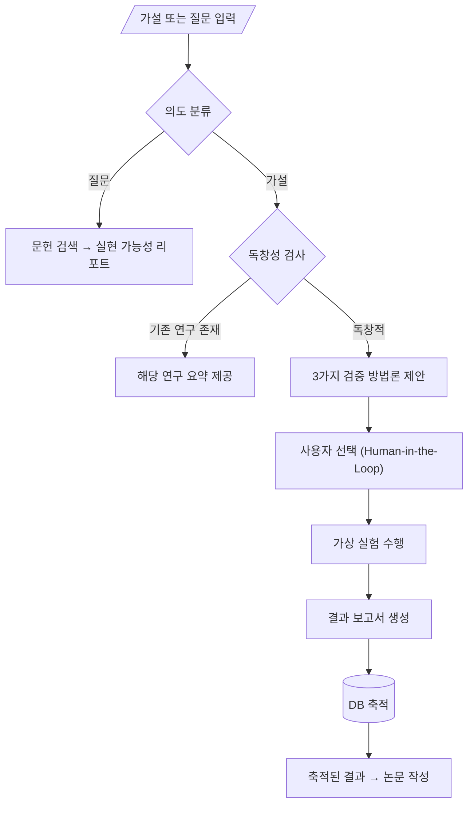

# 🔬 자율 과학 발견 에이전트 프레임워크 기획서

> **프로젝트명**: Virtual Science Lab (VSL)  
> **버전**: 1.0  
> **작성일**: 2026-01-16

---

## 1. 핵심 개요

### 1.1 시스템 목표
사용자의 **가설 또는 질문**을 입력받아 → 문헌 분석 → 방법론 설계 → 가상 실험 수행 → 학술 보고서 자동 생성까지 **자율 수행**하는 AI 연구 동료 시스템

### 1.2 핵심 차별점
| 기존 시스템 | 본 시스템 |
|------------|----------|
| 단순 QA (검색 후 요약) | **가상 실험 수행** (코드 생성 + 실행) |
| 일회성 응답 | **지식 축적** (DB에 결과 저장 → 재활용) |
| 수동 연구 프로세스 | **자율 순환** (Human-in-the-Loop으로 방향만 조정) |

---

## 2. 사용자 워크플로우



---

## 3. 멀티 에이전트 아키텍처

### 3.1 Global State Schema
```python
class ScientificState(TypedDict):
    user_input: str              # 원본 입력
    domain: str                  # 연구 분야 (물리학, 생물학 등)
    intent: Literal["hypothesis", "question"]
    literature_context: List[Dict]  # 검색된 논문들
    novelty_score: float         # 독창성 점수 (0.0~1.0)
    proposed_methods: List[Dict] # 제안된 3가지 방법론
    selected_method: int         # 사용자 선택 인덱스
    code_repository: Dict[str, str]  # 생성된 코드
    execution_logs: str          # 실행 결과
    figures: List[Path]          # 생성된 차트/이미지
    final_report_pdf: Path       # 최종 PDF
```

### 3.2 에이전트 구성 (6개)

| Agent | 역할 | LLM Source | 주요 도구 |
|-------|------|-----------|----------|
| **Router** | 의도 분류 + 도메인 기반 분기 | `claude_code` | Zero-Shot Classifier |
| **Librarian** | 학술 문헌 검색 + RAG | API 직접 호출 | Semantic Scholar, ArXiv |
| **PI** | 독창성 평가 + 방법론 설계 | `claude_code` | Vector Similarity |
| **Engineer** | 코드 생성 + 가상 실험 | `codex` | Docker Sandbox |
| **Critic** | 논리 검증 + 환각 감지 | `claude_code` | Peer Review Sim |
| **Author** | IMRAD 형식 보고서 작성 | `claude_code` | LaTeX/PDF Generator |

---

## 4. 핵심 기술 구현

### 4.1 지식 획득 엔진
```
┌─────────────────────────────────────┐
│         External APIs              │
│  ┌──────────┐  ┌──────────┐        │
│  │ Semantic │  │  ArXiv   │  ...   │
│  │ Scholar  │  │   API    │        │
│  └────┬─────┘  └────┬─────┘        │
└───────┼─────────────┼──────────────┘
        │             │
        ▼             ▼
┌─────────────────────────────────────┐
│   PostgreSQL + pgvector            │
│   (벡터 임베딩 + 메타데이터 저장)    │
└─────────────────────────────────────┘
```

### 4.2 가상 실험 환경 (Sandbox)
- **Docker 컨테이너**: 격리된 Python 환경
- **Self-Healing Loop**: 에러 발생 시 자동 수정 (최대 5회)
- **도메인별 라이브러리**:
  - 물리학: `scipy`, `numpy`, `fenics`
  - 생물학: `biopython`, `rdkit`
  - 데이터과학: `pandas`, `scikit-learn`

### 4.3 보고서 생성
- **IMRAD 구조**: Introduction → Methods → Results → Discussion
- **LaTeX 변환**: 수식 및 레이아웃 전문성 확보
- **비평가 검토**: Reviewer 2 페르소나로 품질 검증

---

## 5. 데이터베이스 스키마

```sql
-- 연구 세션
CREATE TABLE research_sessions (
    id UUID PRIMARY KEY,
    user_query TEXT NOT NULL,
    domain VARCHAR(50),
    intent VARCHAR(20),  -- 'hypothesis' or 'question'
    status VARCHAR(20),  -- 'processing', 'completed', 'failed'
    created_at TIMESTAMP DEFAULT NOW()
);

-- 문헌 지식 베이스
CREATE TABLE literature_knowledge (
    id UUID PRIMARY KEY,
    title TEXT,
    abstract TEXT,
    embedding vector(1536),  -- 벡터 임베딩
    source_api VARCHAR(20)
);

-- 실험 결과
CREATE TABLE experiment_results (
    session_id UUID REFERENCES research_sessions(id),
    methodology TEXT,
    code_snippet TEXT,
    execution_log TEXT,
    report_path TEXT,
    report_embedding vector(1536)
);
```

---

## 6. 구현 로드맵

| 주차 | 마일스톤 | 산출물 |
|:----:|----------|--------|
| 1-2 | 지식 엔진 구축 | API 연동, Vector DB, Librarian Agent |
| 3-4 | 라우팅/검증 로직 | Intent Classifier, Novelty Checker, PI Agent |
| 5-6 | 가상 랩 구축 | Docker Sandbox, Engineer Agent, Self-Healing |
| 7-8 | 통합/리포팅 | LangGraph 연결, LaTeX 생성, Author/Critic Agent |

---

## 7. 기술 스택

```yaml
Language: Python 3.10+

Framework: 
  - LangChain (기본 컴포넌트)
  - LangGraph (상태 관리 + 순환 워크플로우)

LLM Provider: DAACS v2 CLI Assistant
  - claude_code: 추론/기획/검증 (코스트 무료)
  - codex: 코드 생성 특화 (코스트 무료)
  - 외부 API: Semantic Scholar 등 데이터 수집용만

Vector DB: PostgreSQL + pgvector
Sandbox: Docker
UI: Streamlit 또는 Chainlit
PDF: pylatex + pdflatex
```

---

## 8. 향후 확장 방향

1. **Cloud Lab 연동**: 로봇 팔 제어 → 실제 물리 실험 수행
2. **다중 사용자 협업**: 여러 연구자가 결과 공유/검증
3. **자동 논문 투고**: arXiv 자동 업로드 기능

---

> 📊 **참고자료**: 본 기획서는 AI Scientist (Sakana AI), Virtual Lab (zou-group), LangGraph Deep Research 등 최신 연구를 기반으로 작성되었습니다.
